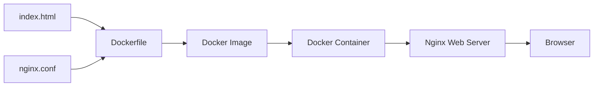
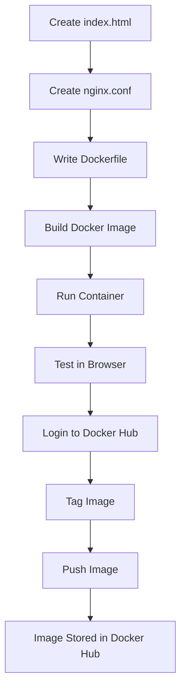
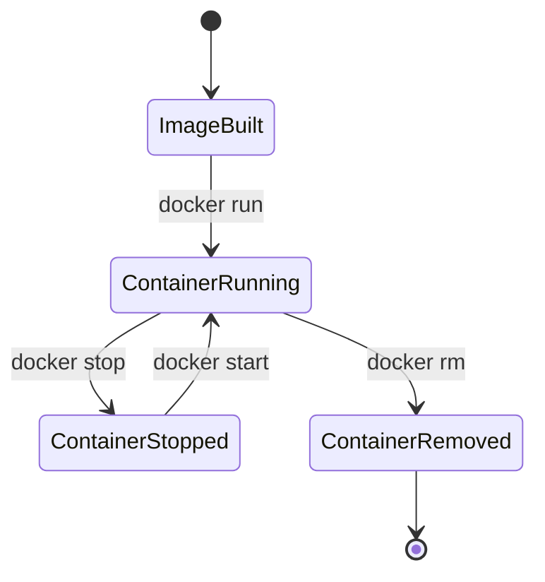

# Docker Task-02 | Static Website Deployment Using Nginx

<p align="center">


</p>

---

## Overview

This project demonstrates how to containerize a static website using **Docker** and **Nginx Alpine**. A custom HTML page and Nginx configuration are packaged into a Docker image, which is then run as a container and published to Docker Hub.

---

## Project Structure

```text
Task-02/
│
├── Dockerfile
├── index.html
├── nginx.conf
└── README.md
```

---

## Architecture



---

## Prerequisites

- Docker Desktop
- Docker CLI
- Docker Hub Account
- Git (Optional)

---

## Dockerfile

```dockerfile
FROM nginx:alpine 

RUN rm -rf /usr/share/nginx/html/*

COPY index.html /usr/share/nginx/html/index.html

COPY nginx.conf /etc/nginx/conf.d/default.conf

EXPOSE 80

CMD [ "nginx","-g","daemon off;"]
```

---

## Nginx Configuration

The project includes a custom **nginx.conf** file.

```dockerfile
COPY nginx.conf /etc/nginx/conf.d/default.conf
```

This replaces the default Nginx server configuration and allows customization of:

- Server configuration
- Static file serving
- Custom routes
- HTTP headers
- Performance optimizations

---

## Build the Docker Image

```bash
docker build -t nginx-task02 .
```

Verify the image:

```bash
docker images
```

Example:

```text
REPOSITORY      TAG       IMAGE ID       CREATED         SIZE
nginx-task02    latest    xxxxxxxxxxxx   2 minutes ago   45MB
```

---

## Run the Container

```bash
docker run -d \
--name nginx-task02-demo \
-p 8080:80 \
nginx-task02
```

Verify:

```bash
docker ps
```

Expected:

```text
CONTAINER ID   IMAGE          STATUS
xxxxxxxxxxxx   nginx-task02   Up
```

---

## Access the Application

Open your browser and navigate to:

```
http://localhost:8080
```

The custom **index.html** page should be displayed.

---

## Verify Inside the Container

Open a shell inside the running container.

```bash
docker exec -it nginx-task02-demo sh
```

Navigate to the web root.

```bash
cd /usr/share/nginx/html
```

Verify files.

```bash
ls
```

Display the HTML page.

```bash
cat index.html
```

Verify the copied Nginx configuration.

```bash
cat /etc/nginx/conf.d/default.conf
```

Exit the container.

```bash
exit
```

---

## Push the Image to Docker Hub

### Login

```bash
docker login
```

### Tag the Image

Replace `<dockerhub-username>` with your Docker Hub username.

```bash
docker tag nginx-task02 <dockerhub-username>/nginx-task02:latest
```

Example

```bash
docker tag nginx-task02 johndoe/nginx-task02:latest
```

### Push

```bash
docker push <dockerhub-username>/nginx-task02:latest
```

Example

```bash
docker push johndoe/nginx-task02:latest
```

---

## Workflow



---

## Container Lifecycle



---

## Testing After Restarting the Laptop

After shutting down the laptop:

- Docker images remain available.
- Containers remain on the system.
- Running containers stop automatically.
- Start the container again before accessing the application.

### Check Existing Containers

```bash
docker ps -a
```

Example

```text
CONTAINER ID   IMAGE          STATUS
xxxxxxxxxxxx   nginx-task02   Exited (0)
```

### Start the Container

```bash
docker start nginx-task02-demo
```

### Verify

```bash
docker ps
```

### Test Again

Open

```
http://localhost:8080
```

The application should be available again.

---

## Enable Automatic Restart

To automatically restart the container whenever Docker starts:

```bash
docker update --restart unless-stopped nginx-task02-demo
```

Or while creating the container:

```bash
docker run -d \
--restart unless-stopped \
--name nginx-task02-demo \
-p 8080:80 \
nginx-task02
```

---

## Frequently Used Docker Commands

| Command | Description |
|----------|-------------|
| `docker images` | List Docker images |
| `docker ps` | List running containers |
| `docker ps -a` | List all containers |
| `docker logs nginx-task02-demo` | View container logs |
| `docker exec -it nginx-task02-demo sh` | Open shell inside container |
| `docker stop nginx-task02-demo` | Stop the container |
| `docker start nginx-task02-demo` | Start the container |
| `docker restart nginx-task02-demo` | Restart the container |
| `docker rm nginx-task02-demo` | Remove the container |
| `docker rmi nginx-task02` | Remove the image |

---

## Expected Output

```text
Browser
┌────────────────────────────────────────────┐
│                                            │
│          Custom Static Website             │
│                                            │
│      Served by Nginx Inside Docker         │
│                                            │
└────────────────────────────────────────────┘
```

---

## Learning Outcomes

- Built a Docker image from a Dockerfile.
- Used the lightweight `nginx:alpine` base image.
- Copied application files into the image.
- Replaced the default Nginx configuration using a custom `nginx.conf`.
- Ran and verified a Docker container.
- Published the image to Docker Hub.
- Understood the Docker container lifecycle.
- Restarted and verified the application after a system reboot.
- Configured automatic container restart using Docker restart policies.

